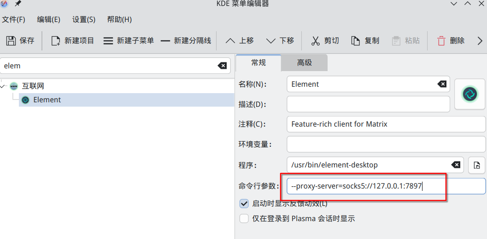

## 1. git每次push都要输入用户名token

`git config --global credential.helper store` 将登陆过的用户名和token永久保存在`~/.git-credentials`中。

## 2. `git status`中文显示乱码

`Git`有一个设置叫做`core.quotepath`，它控制 git 是否将文件路径中的非 ASCII 字符（如中文）
转义为类似 `\356\205` 这样的形式。默认情况下，`Git` 会将非 ASCII 字符转义以确保兼容性。

使用`git config --global core.quotepath false`关闭转义。

## 3. element-desktop 应用使用代理

该方法适用于任何electron应用

添加启动参数`--proxy-server=host:port`

例如:`--proxy-server=socks5://127.0.0.1:7897`

如果使用plasma桌面环境，可在菜单编辑器中如下图配置，并点击左上角保存

