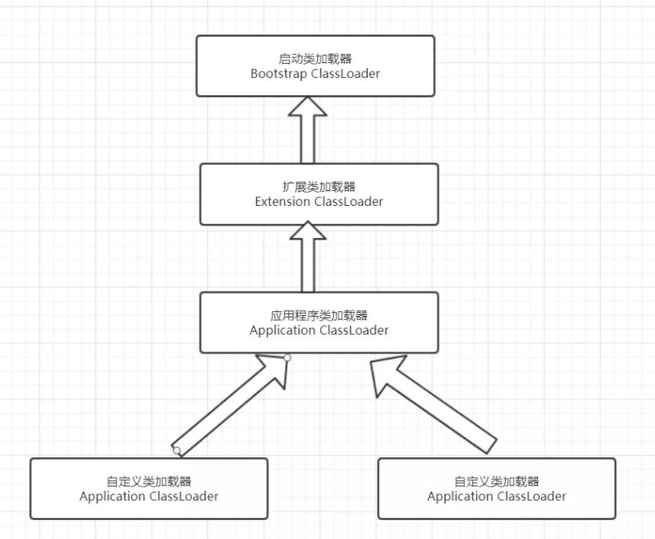

## 1.JVM的结构

#### (1)方法区：

- 该区域较少发生垃圾回收，在这里进行的GC主要是对方法区里的常量池和对类型的卸载。
- 方法区主要用于存储JVM加载的类信息，常量，静态变量和即时编译器编译后的代码等数据。
- 该区域是被线程共享的。
- 方法区中有一个运行时常量池，用于存放静态编译产生的字面量和符号引用。该常量池具有一定动态性，其中的常量并不一定是编译时确定的，运行时产生的常量也会存放在此

#### (2)虚拟机栈：

- 虚拟机栈又被称作栈内存，每个方法在执行时都会创建一个栈帧，用于存储局部变量表，操作数栈，动态链接和方法出口等信息。
- 虚拟机栈是线程私有的，其生命周期与所在的线程相同。
- 局部变量表中存放基本数据类型，returnAddress类型（指向一条字节码指令的地址）和对象引用，这个对象引用可能是指向对象起始地址的一个指针，也可能是代表对象的句柄或与对象关联的位置。局部变量所需的内存空间在编译器间确定。
- 操作数栈用于存储运算结果以及运算的操作数，局部变量表通过索引访问，而操作数栈通过压栈和出栈来访问。
- 每个栈帧都包含一个指向运行时常量池中该栈帧所属方法的引用，持有这个引用是为了支持方法调用过程中的动态链接，动态链接就是将常量池中的符号引用在运行期转化为直接引用。

#### (3)本地方法栈：

本地方法栈与虚拟机栈类似， 只不过本地方法栈为Native方法服务。

>在 Java 中，**Native 方法**（本地方法）是指用 **非 Java 语言**（通常是 C 或 C++）编写的方法，这些方法通过 Java 的 **Java Native Interface**（JNI）与 Java 程序进行交互。`native` 关键字用于声明这些方法，表示它们的实现不在 Java 中，而是在本地代码（如 C 或 C++）中。

#### (4)堆：

java堆是所有线程共享的一块内存，在虚拟机启动时创建，几乎所有的对象实例都在这里创建，因此该区域经常发生垃圾回收。

#### (5)程序计数器：

内存空间小，字节码解释器工作时通过改变这个计数值可以选取下一条需要执行的字节码指令，分支，循环，跳转，异常处理和线程恢复等功能都要依赖这个计数器完成。该内存区域是唯一一个JVM规范没有规定任何OOM情况的区域。

## 2.Heap(堆)与Stack(栈)的区别

#### (1)申请方式
- Stack：由系统自动分配。例如，声明在函数中一个局部变量`int b; `系统自动在栈中为 b 开辟空间。
- Heap: 由程序员申请，指明大小。例如c中的malloc函数，java中需要以手动new Object()的形式开辟。

#### (2)申请后的响应
- Stack: 只要栈的剩余空间大于所申请空间，系统将为程序提供内存，否则将报异常提示栈溢出。
- Heap: 操作系统中，有一个记录空闲内存地址的链表，当系统收到程序的申请时，会遍历该链表，寻找第一个空间大于所申请空间的堆结点，然后将该结点从空闲结点链表中删除，并将该结点的空间分配给程序。另外，由于找到的堆结点大小不一定正好等于申请的大小，系统会自动的将多余的部分重新放入空闲链表。

#### (3)申请大小的限制
- Stack: 栈是向低地址拓展的数据结构，是一块连续的内存区域。栈的地址和最大容量都是系统预先定好的。在32位windows中，栈默认申请大小是1MB，64位windows中则为4MB，这个大小可以通过JVM启动参数来配置。如果申请的内存超过栈的剩余空间，将发生`StackOverFlow`（即栈溢出）。因此，能从栈获得的空间较小。
- Heap: 堆是向高地址拓展的数据结构，操作系统使用链表来存储空闲的内存地址，所以堆是不连续的内存区域。链表的遍历方向是由低地址向高地址。堆的大小受限于计算机系统中有效的虚拟内存。因此，堆获得的空间更灵活也更大。

#### (4)申请效率对比
- Stack: 由系统自动分配，速度较快，但程序员无法控制。
- Heap: 由`new`分配的内存，速度较慢，容易产生碎片，但使用方便。

#### (5)Heap和Stack中的存储内容
- Stack: 在函数调用时，`main`函数的下一条指令的地址首先进栈，然后是函数的各个参数，在大多数的c编译器，参数是从左往右入栈的，然后是函数中的局部变量。（静态变量不入栈）。  
入栈完成后，局部变量先出栈，然后是参数，然后是`main`函数中的下一条指令的地址，程序由该点继续运行。
- Heap: 一般在堆的头部用一个字节存放堆的大小，堆中的内容由程序员安排。

## 3.Java类加载过程

#### (1)加载

类加载的第一个阶段，在此阶段完成3件事：
1. 通过一个类的全限定名获取该类的二进制流。
2. 将该二进制流中的静态存储结构转化为方法区运行的数据结构。
3. 在内存中生成该类的Class对象，作为该类的数据访问入口。

#### (2)验证

验证的目的是为了确保Class文件的字节流中的信息不会危害到虚拟机，在该阶段主要完成下四种验证：
1. 文件格式验证：验证字节流是否符合Class文件的规范，如主次版本号是否在当前虚拟机范围内，常量池中的常量是否有不被支持的类型。
2. 元数据验证：堆字节码描述的信息进行语义分析，如是否有父类，是否继承了不被继承的类等。
3. 字节码验证：是整个验证阶段中最复杂的一个阶段，通过验证数据流和控制流的分析，确定程序语义是否正确，主要针对方法体的验证。如方法中的类型转换是否正确，跳转指令是否正确等。
4. 符号引用验证，这个动作在后面的解析过程中发生，主要为了确保解析动作能正确执行。
5. 准备：为类的静态变量分配内存并将其初始化为默认值。这些内存都将在方法区中进行分配。准备阶段不分配类中的实例变量的内存，实例变量会在对象实例化时随着对象共同分配在java堆中。

### (3)解析

该阶段主要完成符号引用到直接引用的转换动作。解析动作并不一定在初始化动作完成之前，也可能在初始化之后。

### (4)初始化

初始化时类加载的最后一步，前面的类加载过程，除了在加载阶段用户应用程序可以通过自定义类加载器参与之外，其余动作完全由虚拟机主导和控制。到了初始化阶段，才真正开始执行类中定义的Java程序代码。

## 4.类加载器

实现通过类的全限定名获取该类的二进制字节流的代码块叫做类加载器。

主要有以下四种类加载器：
1. 启动类加载器(Biitstrap ClassLoader) 用来加载Java核心类库，无法被Java程序直接引用。
2. 拓展类加载器(extensions ClassLoader) 用来加载Java的拓展库。Java虚拟机的实现会提供一个拓展库目录。该类加载器在此目录里面查找并加载Java类。 
3. 系统类加载器(System ClassLoader) 也叫应用类加载器，它根据Java应用的类路径(CLASSPATH)来加载Java类。一般来说，Java应用的类都是由它来完成加载的。可以通过ClassLoader.getSystemClassLoader()来获取它。
4. 用户自定义类加载器，通过继承Java.lang.ClassLoader类的方式实现。
> Spring使用的类加载器没有继承ClassLoader，而是自己定义了一个类加载器

## 5.垃圾回收的方式

#### (1)引用计数法 

微软的COM/ActionScript3/Python等使用了这种算法。如果对象没有被引用，就会被回收，缺点：需要维护一个引用计数器。

#### (2)复制算法 

年轻代中使用的Minor GC使用了这种算法。效率高，但需要内存容量大。应用于占空间较小，刷新次数较多的新生区。

#### (3)标记清除

老年代一般是由标记清除或者标记清除与标记整理的混合实现。效率较低，会产生碎片。

#### (4)标记压缩（标记整理）

效率低，速度慢，会移动对象，但不会产生碎片。

#### (5)标记压缩-清除 

标记压缩和标记清除的结合，多次GC后才Compact（整理）。适用于占空间大，刷新次数少的老年区，是3 4 算法的结合体。

## 6.GC对象的判定方式

#### 1.引用计数法

给每个对象设置一个引用计数器，每当有一个地方引用这个对象时，就将计数器加一，引用失效时，计数器就减一。当一个对象的引用计数器为零时，说明此对象没有被引用，也就是“死对象”，将会被垃圾回收。  
引用计数法有一个缺陷就是无法解决循环引用问题，也就是说对象A引用对象B，且B同时引用A时，此时A,B对象的引用计数器都不为零，也就造成无法完成垃圾回收，所以主流的虚拟机都没有采用这种算法。

#### 2.可达性算法（引用链法）

该算法通过被称为引用链（GC Roots）的对象作为起点，从这些节点开始向下搜索，搜索走过的路径被称为（Reference Chain），当一个对象到GC Roots没有任何引用链相连时（从GC Roots作为起点不可达），则证明该对象不可用。  
在Java中可以作为GC Roots的对象有以下几种：虚拟机栈中引用的对象，方法区类静态属性引用的对象，方法区常量池引用的对象，本地方法栈JNI引用的对象。 

## 7.Java内存分配与回收策略

#### 内存分配：

(1) 栈区：栈分为Java虚拟机栈和本地方法栈

(2) 堆区：堆被所有线程共享区域，在虚拟机启动时创建，唯一目的存放对象实例。堆区是gc的主要区域，通常情况下分为两个区块年轻代合老年代。

(3) 方法区：被所有线程共享区域，用于存放已被虚拟机加载的类信息，常量，静态变量等数据。被Java虚拟机描述为堆的一个逻辑部分。Java8以前，方法区位于永久代之中，从Java8开始，永久代被元空间取代，方法区也移至元空间中。

(4) 程序计数器： 当前线程所执行的行号指示器。通过改变计数器的值来确定下一条指令，比如循环，分支，跳转，异常处理，线程恢复都是依赖计数器完成的。线程私有的。

#### 回收策略：

(1) 对象优先在堆的Eden区分配。

(2) 大对象直接进入老年代。

(3) 长期存活的对象进入老年代。

Eden区的对象生存期短，往往发生GC的频率较高，回收速度较快，当Eden区没有足够的空间进行分配时，虚拟机会对Eden区执行一次Minor GC；Full GC/Major GC发生在老年代，一般情况下，触发老年代GC时不会触发Minor GC，但可以通过配置，在Full GC之前进行一次Minor GC，加快老年代的回收速度。

## 8.栈溢出的情况

栈是线程私有的，他的生命周期与线程相同，每个方法在执行时都会创建一个栈帧，操作数栈，动态链接，方法出口等信息。局部变量表又包含基本数据类型，对象引用类型。  
如果线程请求的栈深度大于虚拟机允许的最大深度，将抛出StackOveflowError异常，常见的例子是方法递归调用。  
如果Java虚拟机栈可以动态拓展，并且已经尝试过拓展的动作，但仍无法申请到足够的内存区完成拓展，或在新建立线程的时候没有足够的内存去创建对应的虚拟机栈时，可以通过Java参数 -Xss 调整JVM栈的大小。

## 9.JVM中的GC流程

对象诞生即为新生代(eden)，在进行Minor GC操作过程中，如果存活，则移动到from区，成为Survivor，并进行一次标记。如果对象默认超过15次都没有被回收，就会进入老年代。

## 10.垃圾收集器

垃圾收集器包括 Serial, SerialOld, ParallelScavenge, ParalleOld, CMS, G1

#### CMS:

**工作流程**

1. 初始标记：暂停用户线程，简单的标记能够关联的对象；
2. 并发标记：从GC Root开始对堆进行可达性分析，找出存活的对象，这段耗时较长，但可以并发执行；
3. 重新标记：暂停用户线程，对并发标记的垃圾进行二次确认（确认被标记的对象仍没有被使用），将这部分标记记录在Remembered Set中；
4. 并发清除：对标记的垃圾进行清除，可以与用户线程并发执行；

**优点**：
- 充分利用多线程环境，主要工作都属于并发执行，停顿时间很短；

**缺点**：
- 并发阶段会影响主程序性能；
- 无法清除浮动垃圾；
- CMS基于标记清除算法实现，会产生较多的内存碎片；
- 停顿时间难以预测，收到内存占用影响，波动较大，尤其是在Full GC中；

#### G1：

G1 GC 是为了克服 CMS GC 在高并发和大内存环境中的一些问题而引入的，从Java9开始，G1取代了GMS作为Java默认垃圾收集器的地位。

**工作流程**

1. 初始标记，标记GC Root能直接关联的对象，修改TAMS的值，使下一阶段能够并发执行，能够正确运用Region创建新对象，此阶段需要停顿，但停顿时间很短。
2. 并发标记：从GC Root开始对堆进行可达性分析，找出存活的对象，这段耗时较长，但可以并发执行；
3. 最终标记：暂停用户线程，对并发标记的垃圾进行二次确认，将这部分标记记录在`Remembered Set`中；
4. 筛选回收：首先对各个Region的回收价值和成本进行排序，根据用户所期待的Gc停顿时间指定回收计划，由于只回收部分Region（区域），回收时间是可控的。相较于CMS，停顿用户线程可大幅提高收集效率。

**优点**
- 更可预测的停顿时间，G1将堆划分为多个Region,每个Region大小相同，且回收策略更加灵活，可通过设置JVM运行参数来控制停顿时间。
- 更适合大内存系统，G1划分Region能够更好的管理大内存系统，减少停顿时间；
- 更灵活的回收选择，G1可以由用户选择优先回收的区域，例如优先回收老年代或年轻代；

**缺点**
- 启动时间较长；
- 初始标记阶段可能带来较长的停顿，性能可能较差，但会随着运行逐步减少；

## 11.JVM内存模型

- 重排序：JVM允许在不影响代码最终情况下乱序执行。
- 内存屏障：可以阻挡编译器优化和处理器优化。
- 主内存：所有内存共享的内存空间
- 工作内存： 每个线程独有的内存空间
- happens-before原则：
1. 一个线程A的操作总是在B之前，那多线程的A操作肯定也在B之前。
2. monitor再加锁的情况下，持有锁的肯定限制性。
3. volatile修饰的情况下，写先于读发生。
4. 线程启动在一切之前(start)。
5. 线程死亡在一切之后(end)。
6. 线程操作在一切线程中断之前。
7. 一个对象的构造函数的结束在finalizer开始前。
8. 如果A肯定在B之前，B肯定在C之前，那么A肯定在C之前。

## 12.类加载器与双亲委派

**类加载器**
- 类加载器就是根据全限定名称将Class文件加载到JVM内存中，转化为Class对象的一个核心组件。
- 启动类加载器（BootStrap ClassLoader）：由C++语言实现（针对HotSpot），负责将存放在`<JAVA_HOME>\lib`目录或-Xbootclasspath参数指定路径中的类加载到内存中。
- 其他类加载器：
1. 拓展类加载器（Extension ClassLoader）：负责加载`<JAVA_HOME>\lib\ext`目录或java.ext.dirs系统变量指定的路径中的所有类库。
2. 应用程序类加载器（Application ClassLoader）：负责加载用户类路径（classpath）上的指定类库，我们可以直接使用这个类加载器。一般情况，如果我们没有自定义类加载器，默认使用应用程序类加载器。

**双亲委派**
- 如果一个类加载器收到类加载的请求，他首先不会自己尝试去加载这个类，而是把这个请求委派给父类加载器完成，每个类加载器都是如此，只有当父加载器在自己的搜索范围找不到指定的类时（ClassNotFoundException），子加载器才会尝试自己去加载。
- 双亲委派模型可以保证类的唯一性，避免出现多份同样的字节码。
- 想要打破双亲委派模型，需要继承ClassLoader类，并重写loadClass和findClass方法

## 13.JVM参数
**1.堆栈配置**

`java -Xmx3550m -Xms3550m -Xmn2g -Xss128k -XX:MaxPermSize=16m -XX:NewRatio=4 -XX:MaxTenuringThreshold=0
我们逐个介绍

|参数|含义|
|----|-----|
|-Xmx3550m|最大堆大小为3550m|
|-Xms3550m|初始堆大小为3550m|
|-Xmn2g|年轻代大小为2g|
|-Xss128k|每个线程栈大小为128k|
|~~-XX:MaxPermSize~~|设置永久代大小为16m(永久代已于Java8弃用)|
|-XX:NewRatio=4|设置年轻代（包括Eden和Survivor区）与老年代比值|
|-XX:SurvivorRatio=4|设置年轻代中Eden区与单个Survivor区的比值|
|-XX:MaxTenuringThreshold=0|设置垃圾最大年龄，年龄的单位为GC次数，如果设为0，则年轻代不经过Survivor直接进入老年代|

**2.垃圾收集器配置**

|参数|含义|
|----|-----|
|-XX:+UseParallelGC|选择使用并行收集器|
|-XX:ParalllelGCThreads=20|配置并行收集器线程数为20|
|-XX:+UseConcMarkSweepGC|设置老年代为并发收集|
|-XX:CMSFullGCsBeforeCompaction=5|运行5次GC后对内存空间进行压缩整理|
|-XX:+UseCMSCompactAtFullCollection|打开对老年代的压缩，可能会影响性能，但可以消除碎片|

**3.辅助信息配置**

|-XX:+PrintGC|开启简单的垃圾收集输出日志，形式类似`[GC 118250K->113543K(130112K), 0.0094143 secs] [Full GC 121376K->10414K(130112K), 0.0650971 secs]` |
|-XX:PrintGCDetails|打印更详细的输出日志，形式类似`[GC [DefNew: 8614K->781K(9088K), 0.0123035 secs] 118250K->113543K(130112K), 0.0124633 secs] [GC [DefNew: 8614K->8614K(9088K), 0.0000665 secs][Tenured: 112761K->10414K(121024K), 0.0433488 secs] 121376K->10414K(130112K), 0.0436268 secs`|

## 14.垃圾收集算法

JVM的垃圾回收算法有三种:
1. 标记清除算法：把标注的可回收对象直接清理。会带来内存碎片化的问题，且效率较低。
2. 标记整理算法：把标注的可回收对象清理，在清理的过程中整理内存，解决了内存的碎片化问题，但效率更低。
3. 标记复制算法：把标注的对象清理，没有清理的复制到to区，然后清理时与from区互换，解决了内存碎片化的问题，但需要维护对象关系，会浪费一部分内存。

## 15.JVM调优工具

常用调优工具有两类，第一类JDK自带监控工具jconsole和jvisualvm，第二类第三方工具有MAT（Memory Analyzer Tool）、GChisto。
- JConsole：Java Monitoring and Management Console是从Java5开始，JDK自带的Java监控和管理控制台，用于对JVM中内存，线程和类的监控。
- JVisuallVm，JDK自带的全能工具，可以分析内存快照，线程快照；监控内存变化，GC变化等。
- MAT：Memory Analyzer Tool，一个基于Eclipse的内存分析工具，是一个快速，功能丰富的Java Heap分析工具，可以查找内存泄漏和减少内存消耗。
- GChisto：专业分析gc日志的工具。

## 16.JVM调优手段

JVM调优时不能只看操作系统级别Java进程占用的内存，这个数值不能准确反映堆内存的真是占用情况。因为GC过后这个值不会变化，因此，内存调优的时候要更多使用JDK提供的内存查看工具，如JConsole和Java VisualVM。

对JVM内存的系统级调优主要目的是减少GC的频率和FullGC的次数，过多的GC和Full GC会占用很多的系统资源（主要是CPU），影响系统的吞吐量。特别要关注Full GC，因为它会对整个堆进行整理，导致Full GC一般有以下几种情况：
- 旧生代空间不足
    - 解决方案：调优时尽量让对象在新生代GC时被回收，让对象在新生代多存活一段时间，不要创建过大的对象及数组，避免直接在老年代创建对象。
- Permanent Genneration(Perm Gen)空间不足：
    - 增大Perm Gen空间，避免太多静态对象
    - 统计得到的GC后晋升到老年代的平均大小大于老年代剩余空间
    - 解决方案：控制好新生代和老年代比例。
- System.gc()显示被调用
    - 解决方案：垃圾回收不要手动触发，尽量依靠JVM自身的机制

调优手段主要是通过控制堆内存的各个部分的比例和GC策略来实现，下面来看看各部分比例不良设置会导致什么后果。
- 新生代设置过小：新生代GC次数会非常频繁，增大系统消耗；导致大对象直接进入老年代，占据了老年代剩余空间，诱发Full GC。
- 新生代设置过大：堆总量一定时，会导致老年代过小，诱发Full GC；新生代GC耗时大幅度增加；一般来说新生代占堆的1/3较为合适。
- Survivor设置过小：导致对象从eden直接到达老年代，降低了在新生代的存活时间。
- Survivor设置过大：导致eden过小，增加了GC频率，另外，通过`-XX:
==MaxTenuringThreshold=n`来控制新生代存活时间，尽量让对象在新生代被回收。

由内存管理和垃圾回收可知，新生代和老年代都有多种GC策略和组合搭配，选择这些策略对开发人员来说是个难题。JVM提供了两种较为简单的GC策略的设置方式。
1. 吞吐量优先：JVM以吞吐量为指标，自行选择相应的GC策略及控制新生代与老年代的大小比例，来达到吞吐指标。这个值可以由`-XX:GCTimeRatio=n`来设置。
2. 暂停时间优先：JVM以暂停时间为指标，自行选择相应的GC策略及控制新生代与老年代的大小比例，尽量保证每次GC造成的应用停止时间都在指定的数值范围内完成。这个值可由`-XX:MaxGCPauseRatio=n`来设置。

## 17.Eden和Survivor的比例分配

默认比例是8:1。部分对象很快就会成为垃圾被清理，复制算法的思想是将内存分为两块，每次只使用其中一块，当这一块内存用完，就将活着的对象复制到另外一块上面。复制算法不会产生内存碎片。

## 18.CLASSPATH环境变量

- CLASSPATH是javac编译器的一个环境变量，设置了Java运行时和编译时用来定位类文件和资源文件的路径集合，他可以包含多个目录，JAR文件和ZIP文件。当编译器面对import package语句时，会首先查找CLASSPATH所在的目录，并检视java/util是否存在，然后找出名称吻合的已编译文件（.class文件）。如果没找到会抛出ClassNotFOundException异常。
- 当出现ClassNotFoundException异常时，动态加载包可以在不改变类路径的情况下，正确加载这个类。
